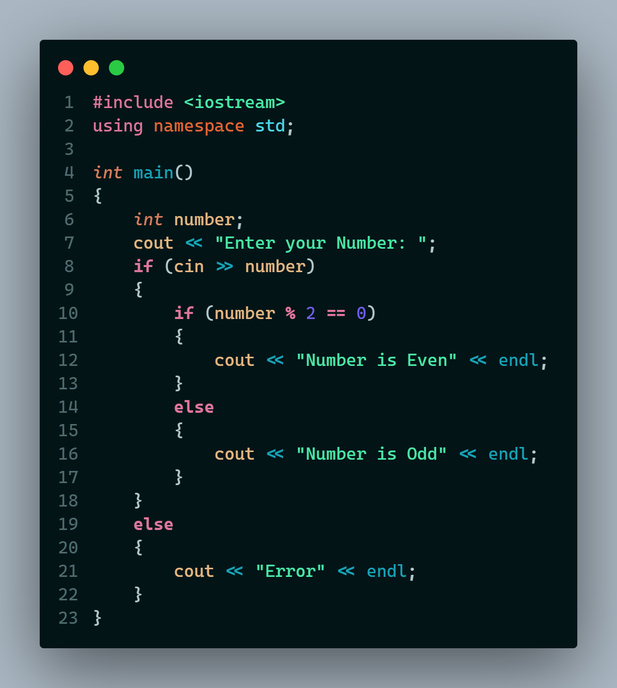
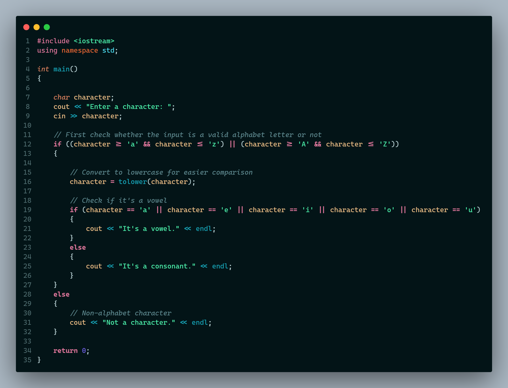

# Problems Related to Conditional Statement

---

Since we have learned the basics of if, else if conditions, let's try to solve some problems related to it.

First try to solve the problem by yourself and then check the answer. If you just see the answer and dont try it will not do any improvement in your coding skills. So first try by yourself, give some time to think and then check the answers.

_N.B: There are Multiple ways to approach a problem and solve it. I will be just showing only one way or method to solve the problem._

---

 

Problem 1: Take any Integer Input through keyboard. Write a program to find out whether its an odd number or an even number. For inputs that are not a number, the program will show `Error` as output

 

Problem 2: Take any letter Input through keyboard. Write a program to find out whether its a vowel or consonant. For non-alphabets input , the program will show `Not a Character` as output

---

> Let's Create a Difference, Together
