# C++ Fundamentals: Building a Strong Foundation


---

In this blog series, we will cover the essential building blocks of C++ programming, making it accessible for beginners and those looking to reinforce their core knowledge. We'll cover topics such as the basics of C++ syntax and data types, how to create and use functions, the importance of variables and memory management, and understanding control structures like loops and conditionals.

By the end of this series, you'll have a strong foundation in C++, setting the stage for your journey into more advanced aspects of this powerful programming language. So let's get started

---

### Programming 101: A Brief Overview

Before learning C++ or any other programming language, one should know what programming actually is. Let's understand it in a practical and relatable way


**Programming is like making coffee: it's a process of following a recipe to create something delicious.**

In both cases, you start with the right ingredients (code or coffee beans and water). Then, you follow a set of steps to create the desired output (a working program or a delicious cup of coffee). If something goes wrong, you need to debug the process (fix the code or adjust the coffee brewing).

And just like with coffee, there are many different ways to approach programming. You can use different tools, languages, and frameworks to create the same program. And you can customize your approach to suit your own style and preferences.

Here's a fun analogy:

**Imagine that you're a programming barista. Your job is to create custom coffee drinks for your customers.**

Each customer has their own unique preferences, so you need to be able to adapt your recipes accordingly. You also need to be able to troubleshoot problems if something goes wrong.

For example, if a customer orders a latte but their coffee is too weak, you know that you need to use more coffee grounds. Or, if a customer's espresso is too bitter, you know that you need to use less coffee grounds or grind the beans more coarsely.

In the same way, programmers need to be able to adapt their code to solve different problems and troubleshoot errors.

Let us understand it in another way also, **Programming is like giving instructions to a robot.**

You tell the robot what to do, step by step, and it follows your instructions. If you give the robot clear and concise instructions, it will be able to complete the task without any problems. But if your instructions are unclear or incomplete, the robot will get confused and may not be able to complete the task.

Programming is similar. You write instructions for a computer to follow, and the computer follows your instructions to complete a task. If your instructions are clear and concise, the computer will be able to complete the task without any problems. But if your instructions are unclear or incomplete, the computer will get confused and may not be able to complete the task.


Here is a simple example:

```
Tell the robot to go to the kitchen and make a cup of coffee.
```

The robot would need to know the following steps to complete this task:

1. Walk to the kitchen.
2. Open the kitchen cabinet and get a coffee cup.
3. Walk to the sink and fill the coffee cup with water.
4. Walk to the coffee maker and add coffee grounds to the filter.
5. Place the coffee cup under the filter basket.
6. Turn on the coffee maker.
7. Wait for the coffee to brew.
8. Turn off the coffee maker.
9. Bring the cup of coffee back to the living room.

If you gave the robot the following instructions:

```
Go to the kitchen and make a cup of coffee.
```

The robot would not know what steps to take to complete this task. It would need more specific instructions, such as the steps listed above.

---

### Exploring C++: Its Language and Origins

C++ is a programming language that is like a powerful toolbox for building software.

Imagine that you are a carpenter. You have a toolbox full of tools that you can use to build different things, such as tables, chairs, and houses. C++ is like a toolbox for programmers. It has a variety of tools that you can use to build different types of software, such as operating systems, games, and web applications.

Some of the tools in C++ toolbox include:

-   **Data types:** These are used to store different types of information, such as numbers, strings, floats and Boolean values.
-   **Control flow:** These are used to control the flow of execution of your program.
-   **Functions:** These are reusable blocks of code that can be used to perform specific tasks.
-   **Classes and objects:** These are used to create reusable code modules that can be used to model real-world objects and their interactions.

Don't worry, you don't have to understand them right now. We will go through them in an easy order and way to understand each concept.

> You can imagine that C++ is a magic wand. With C++, you can create anything you can imagine, from simple programs to complex applications.
>
> Just like a magic wand, C++ is a powerful tool, but it can also be dangerous if used incorrectly. It is important to learn how to use C++ safely and responsibly.

Before getting to know this magic wand, lets get to know how it was born.

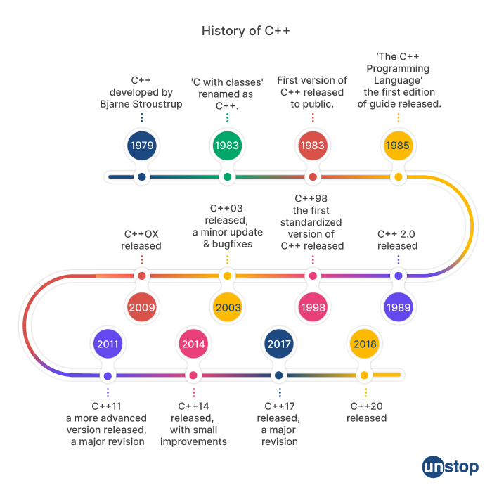
_Image Credit: Unstop_

C++ was born in 1979, when Bjarne Stroustrup first started developing it. C++ was a small and simple language at first, but it grew and matured over time.

In 1983, C++ was officially named and released to the public. This was like C++ graduating from kindergarten and starting elementary school. In the years that followed, C++ continued to grow and learn. New features were added, and the language became more powerful and versatile.

In 1998, C++ reached middle school. This was the release of C++2, which added new features such as templates and exception handling. C++ continued to grow and mature in high school. New features were added, and the language became more standardized.

In 2003, C++ graduated from high school and entered college. This was the release of C++3, which added new features such as namespaces and type safety.

C++ continues to grow and learn in college. New features are added, and the language becomes more sophisticated.

In 2011, C++ reached adulthood. This was the release of C++11, which added major new features such as move semantics, lambda expressions, and smart pointers.

C++ continues to evolve today, as new features are added and the language becomes more powerful and versatile.

---

### Writing Your First C++ Program: Hello World

Okay, Lets write some code with our magic wand C++ and do some magic and understand how does this magic work.

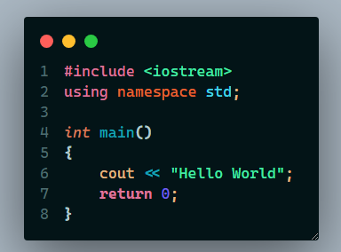

This is the basic simple Hello World program written in C++ where the program will just display us "Hello World" . But how does this code actually works.

From what we are seeing in this code, we see that there is something in

```c++
cout << "Hello World";
```

and we are seeing `Hello World` in the output. That means whatever we write in those quotation marks in the exact same code structure, the program will give us an output of those words. Lets try out with a different text and see if it prints.

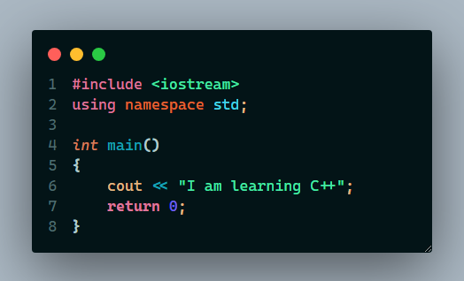

> Output

```bash
I am learning C++
```

Here we can see that yes whatever we are writing inside those double quotations, it is getting displayed in the terminal. You can try it out displaying your own name in the terminal.

so if we break this program, we can see this
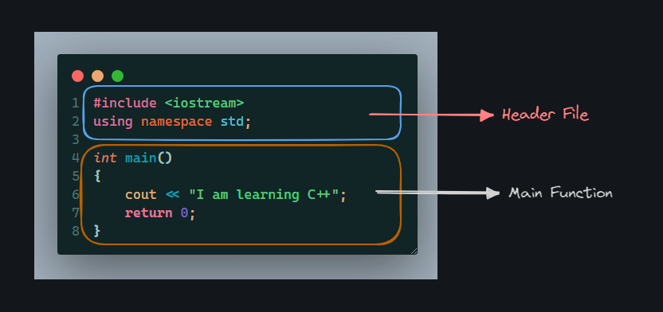
where we can divide the whole program into two parts

1. Header File
2. Main Function

In the Header file area we mainly declare that which C++ files we will be using to run our programs. In this particular example we are using `iostream` header file. To use a header file we need to write `#include<header-file-name>` because only then the C++ compiler will understand that we want to use this header file in our program.

Second part is the Main Function area where we will be doing most of our works. The `main()` function in C++ is like the starting gate at a race. It is the first function that is executed when a C++ program is run. The `main()` function in C++ is like the starting gate for your program. When the program starts, the `main()` function is executed. The `main()` function then tells your program what to do.

Another way of understanding the `main()` function is that imagine you are a chef and you are cooking a meal. The `main()` function is like the recipe for your meal. It tells you what ingredients to use and how to combine them.

If you follow the recipe correctly, you will end up with a delicious meal. But if you make a mistake in the recipe, you may end up with a disaster.

The same is true for the `main()` function in C++. If you write the `main()` function correctly, your program will work as expected. But if you make a mistake in the `main()` function, your program may not work at all.

Now if we look inside the `main()` function we can see that the first line is:

```c++
cout << "I am learning C++";
```

where `I am learning C++` gets displayed on the terminal/console. The `cout` is a short form of "console output". It is a predefined object in the `std` namespace that is used to print output to the console.

And the `return 0` statement in the end of the `main()` function in C++ tells the operating system that the program has terminated successfully.

The operating system uses the return value from the `main()` function to determine how to exit the program. If the return value is 0, the operating system knows that the program terminated successfully. Otherwise, the operating system knows that the program terminated with an error.

---

#### Chapter-1: Variables and Constants

Variables in C++ are like boxes that you can store information in.

Imagine that you are a carpenter and you are building a bookshelf. You need to store the dimensions of the bookshelf somewhere, so you create a box to store the information.

Variables in C++ work in a similar way. You can use variables to store different types of information, such as numbers, strings, and Boolean values.

There are different sizes and types of boxes/container to store information in which are known as different data types. These data types are :

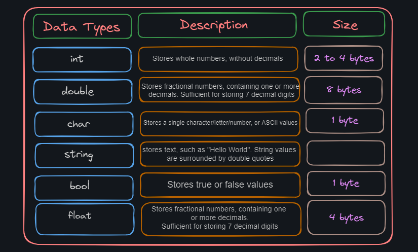

-   **int:** Whole numbers like 1, 2, 3, and 4 - a box of whole numbers from -2147483648 to 2147483647.
-   **float:** Decimal numbers like 3.14159 and 0.5 - a box of decimal numbers precise to at least 7 decimal places.
-   **double:** Even more precise decimal numbers than floats - a box of decimal numbers precise to at least 15 decimal places.
-   **char:** Single characters like 'a', 'b', and 'c' - a box of single characters from 'a' to 'z' and from 'A' to 'Z'.
-   **string:** Sequences of characters like "hello world" - a box of sequences of characters like "hello world" or "1234567890".
-   **bool:** True or false values - a box of true or false.

we declare a variable in this format:

```c++
data_type variable_name = value;
```

where in the data_type we will declare the variable type whether it will be an int or a float or string. such as

```c++
#include<iostream>
using namespace std;
int main()
{
	string language = "C++";
	int my_number = 17;
	float my_float = 3.1416;
	char my_character = 'A';
}
```

Variables can be used in two ways. We can first initialize the variable like `string language;`
and then on another line we can declare the variable of the value like `language = "C++";`
or another way is to initialize and declare in the same line. just like the below picture

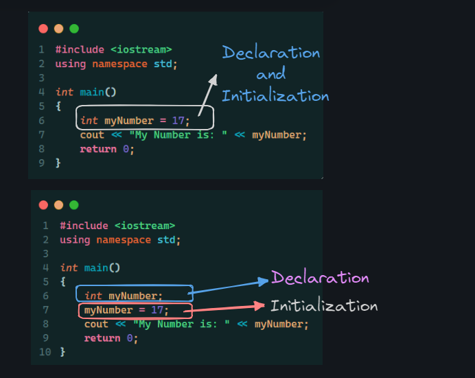

There are some general rules for naming a variable. Those are

1. Names can contain letters, digits and underscores

2. Names must begin with a letter or an underscore (\_)

3. Names are case sensitive (myName and myname are different variables)

4. Names cannot contain whitespaces or special characters like !, #, %, etc.

5. Reserved words (like C++ keywords, such as int) cannot be used as names.

**Identifiers :** All C++ variables must be identified with unique names. These unique names are called identifiers.


**Constants in C++ are variables that cannot be changed after they are initialized.**

Constants are used to represent values that are known and will not change throughout the execution of a program. For example, you might use a constant to represent the acceleration due to gravity, or the number of days in a year.

Constants are declared using the keyword `const`
For example, the following code declares a constant called `PI` that represents the mathematical constant pi:

```c++
const double PI = 3.14159;
```

Once a constant is initialized, its value cannot be changed. For example, the following code would cause a compile-time error:

```c++
PI = 4.0; // This will cause a compile-time error!
```

Constants are a valuable tool for writing clear and concise code. They can help to make your code more readable and maintainable.

Imagine that you have a box of constant values. You can put any value in the box, but once you put it in, you cannot take it out.

Constants are like the values in this box. They are known and cannot be changed.

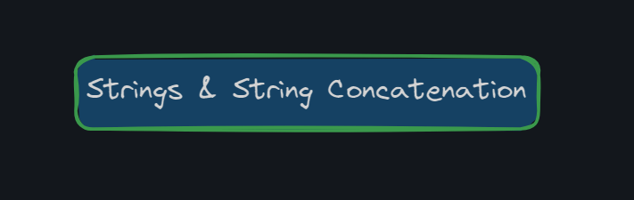

**Strings in C++ are sequences of characters.** They are enclosed in double quotes (" ").

For example, the following code declares a string variable called `my_string` and assigns it the value "Hello, world!":

```c++
string my_string = "Hello, world!";
```

Strings can be used to store text, such as names, addresses, and messages. They can also be used to store formatted text, such as HTML and XML.

**String concatenation in C++ is the process of joining two or more strings together.**

The following code concatenates the strings "Hello, " and "world!" together:

```c++
string my_new_string = "Hello, " + "world!";
```

This code will assign the value "Hello, world!" to the variable `my_new_string`.

String concatenation can be used to create new strings, or to modify existing strings.

Here is an example of how to use string concatenation to create a new string:

```c++
string my_name = "C++";
string my_greeting = "Hello, " + my_name + "!";
```

This code will assign the value "Hello, Bard!" to the variable `my_greeting`.

Here is an example of how to use string concatenation to modify an existing string:

```c++
string my_message = "This is a message.";
my_message = my_message + " It is now longer.";
```

This code will modify the value of the variable `my_message` to "This is a message. It is now longer."

String concatenation is a powerful feature of C++ that allows you to manipulate strings in a variety of ways.

Suppose you are a baker and you are making a cake. You use string concatenation to combine different ingredients to create a new cake.

String concatenation in C++ is like the baker using different ingredients to create a new cake. It allows you to combine different strings to create a new string.

##### Append Child Method:

The `append()` function in C++ is used to concatenate a string to the end of another string.

The following code shows how to use the `append()` function to concatenate the strings "Hello, " and "world!":

```c++
string my_string = "Hello, ";
my_string.append("world!");
```

This code will modify the value of the variable `my_string` to "Hello, world!".

The `append()` function can be used to concatenate any type of data to a string, such as numbers, characters, and boolean values.

Here is an example of how to use the `append()` function to concatenate a number to a string:

```c++
string my_string = "The number is: ";
my_string.append(10);
```

This code will modify the value of the variable `my_string` to "The number is: 10".

The `append()` function is a powerful tool for manipulating strings in C++. It allows you to concatenate different types of data to strings, which can be used to create more complex and expressive strings.

Imagine that you are a chef and you are making a salad. You use the `append()` function to add different ingredients to the salad.

The `append()` function in C++ is like the chef using the `append()` function to add different ingredients to the salad. It allows you to add different types of data to a string.

---

#### Chapter 2: Operators in C++

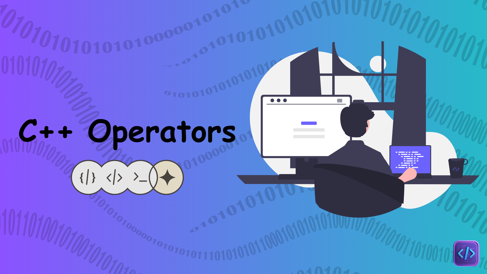

Operators in C++ are symbols that perform operations on variables and expressions.

There are many different types of operators in C++, but they can be broadly categorized into the following groups:

1. Arithmetic operators
2. Assignment operators
3. Comparison operators
4. Logical operators

##### 1. Arithmetic Operators:

Arithmetic operators in C++ are used to perform mathematical operations on numbers.
The following table shows the most common arithmetic operators in C++:

| Operator | Name           | Description                            | Example |
| -------- | -------------- | -------------------------------------- | ------- |
| +        | Addition       | Adds together two values               | a + b   |
| -        | Subtraction    | Subtracts one value from another       | a - b   |
| \*       | Multiplication | Multiplies two values                  | a \* b  |
| /        | Division       | Divides one value by another           | a / b   |
| %        | Modulus        | Returns the division remainder         | a % b   |
| ++       | Increment      | Increases the value of a variable by 1 | ++a     |
| --       | Decrement      | Decreases the value of a variable by 1 | --a     |

Arithmetic operators can be used to perform calculations on variables and expressions. For example, the following code calculates the sum of two numbers and assigns the result to a variable called `result`:

```c++
int a = 10;
int b = 20;
int result = a + b;
```

The following code calculates the average of three numbers and prints the result to the console:

```c++
int a = 10;
int b = 20;
int c = 30;

float average = (a + b + c) / 3.0f;
cout << "The average is: " << average << endl;
```

Arithmetic operators are a fundamental part of C++ programming. They allow you to perform calculations on numbers and variables.

##### 2. Assignment Operators:

Assignment operators in C++ are used to assign values to variables.

The following table shows the most common assignment operators in C++:

| Operator | Description                          |
| -------- | ------------------------------------ |
| `=`      | Simple assignment                    |
| `+=`     | Compound assignment (addition)       |
| `-=`     | Compound assignment (subtraction)    |
| `*=`     | Compound assignment (multiplication) |
| `/=`     | Compound assignment (division)       |
| `%=`     | Compound assignment (modulo)         |

Assignment operators are used to store values in variables. For example, the following code assigns the value 10 to the variable `a`:

```c++
int a = 10;
```

The following code increments the value of the variable `a` by 1:

```c++
a += 1;
```

Assignment operators are a fundamental part of C++ programming. They allow you to store values in variables and manipulate them.

Imagine that you have a box and you want to store a value in it. You use the assignment operators to put the value into the box.

Assignment operators in C++ are like the boxes that you use to store values in your programs. They allow you to store values in variables and manipulate them.

##### 3. Comparison Operators:

Comparison operators in C++ are used to compare two values and return a boolean value, which is either true or false.

The following table shows the most common comparison operators in C++:

| Operator | Description              |
| -------- | ------------------------ |
| `<`      | Less than                |
| `>`      | Greater than             |
| `<=`     | Less than or equal to    |
| `>=`     | Greater than or equal to |
| `==`     | Equal to                 |
| `!=`     | Not equal to             |

Comparison operators can be used in expressions to control the flow of your program. For example, you can use a comparison operator in a conditional statement to check if a condition is met.

Here is an example of how to use a comparison operator in a conditional statement:

```c++
int a = 10;
int b = 20;

if (a < b) {
  cout << "a is less than b" << endl;
} else {
  cout << "a is not less than b" << endl;
}
```

Output:

```
a is less than b
```

Comparison operators are a powerful tool for writing conditional statements and other control flow statements in C++.

Suppose you are a judge and you are comparing two people. You use the comparison operators to determine which person is taller, shorter, heavier, lighter, or older.

Comparison operators in C++ are like the comparison tools that a judge uses. They allow you to compare two values and determine which value is greater or less than the other.

##### 4. Logical Operators:

Logical operators in C++ are used to combine boolean values to produce new boolean values.

The following table shows the most common logical operators in C++:

| Operator                  | Description |
| ------------------------- | ----------- |
| `&&`                      | Logical AND |
| <code>&#124;&#124;</code> | Logical OR  |
| `!`                       | Logical NOT |

Logical operators can be used to control the flow of your program. For example, you can use a logical operator in a conditional statement to check if multiple conditions are met.

Here is an example of how to use a logical operator in a conditional statement:

```c++
bool a = true;
bool b = false;

if (a && b) {
  cout << "Both conditions are met" << endl;
} else if (a || b) {
  cout << "At least one condition is met" << endl;
} else {
  cout << "Neither condition is met" << endl;
}
```

Output:

```
Neither condition is met
```

Logical operators are a powerful tool for writing conditional statements and other control flow statements in C++.

Imagine that you are a judge and you are deciding a case. You use the logical operators to determine whether the defendant is guilty or not guilty.

Logical operators in C++ are like the tools that a judge uses to determine the guilt or innocence of a defendant. They allow you to combine boolean values to produce new boolean values, which can be used to control the flow of your program.

---

#### Chapter 3: User Input

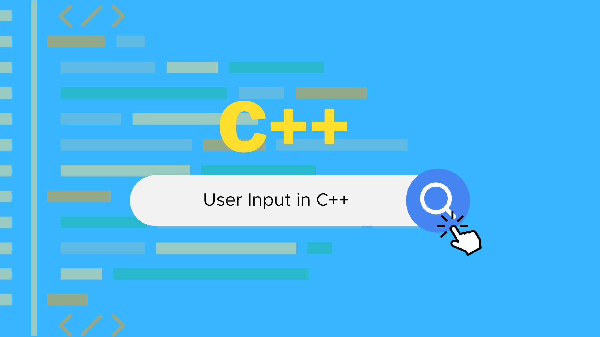

User input in C++ is the process of getting data from the user and storing it in a variable. This can be done using the `cin` object.

The `cin` object is a predefined object in C++ that is used to read input from the user. It can be used to read different types of data, such as numbers, characters, and strings.

To get user input in C++, you can use the following syntax:

```c++
cin >> variable_name;
```

For example, the following code will get a number from the user and store it in the variable `my_number`:

```c++
int my_number;
cin >> my_number;
```

Once you have gotten user input, you can use it in your program as needed.

Here is an example of a simple program that gets user input and prints it to the console:

```C++
#include <iostream>

int main() {
  int my_number;
  std::cout << "Enter a number: ";
  cin >> my_number;

  std::cout << "You entered: " << my_number << std::endl;

  return 0;
}
```

Output:

```
Enter a number: 10
You entered: 10
```

User input is a powerful feature of C++ that allows you to interact with your users and get data from them. It can be used to create more dynamic and interactive programs.

Imagine that you are a shopkeeper and you are taking orders from your customers. You use the `cin` object to get the order from the customer and store it in a variable.

User input in C++ is like the shopkeeper using the `cin` object to get the order from the customer. It allows the shopkeeper to get data from the customer and use it to fulfill the order.

##### Bonus: Typecasting

Typecasting in C++ is the process of changing the type of a variable. For example, you can change an integer variable to a float variable, or a string variable to an integer variable.

```c++
#include<iostream>
using namespace std;

int main()
{
    float a= 3.45; float b= 4.57;
    float z = a +  b;
    cout<< z; //output 8.02
    return 0;
}
```

```c++
#include<iostream>
using namespace std;

int main()
{
    float a= 3.45; float b= 4.57;
    int z;
    z= (int)a + (int) b;
    cout<< z; //output 7
    return 0;
}
```

Imagine that you are a baker and you are making a cake. You need to use different ingredients in different proportions.

Typecasting in C++ is like the baker converting different ingredients to different formats. It allows the baker to use the ingredients in the recipe.

---

#### Chapter 4: Conditionals

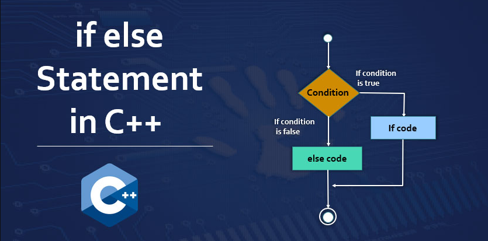

Conditions in C++ are used to control the flow of your program. They allow you to check for certain conditions and then execute different code depending on the outcome of the check.

C++ has the following conditional statements:

1. Use `if` to specify a block of code to be executed, if a specified condition is true

2. Use `else` to specify a block of code to be executed, if the same condition is false

3. Use `else if` to specify a new condition to test, if the first condition is false

If you are a traffic controller and you are controlling the flow of traffic at an intersection. You use traffic lights to control the flow of traffic in different directions.

Conditions in C++ are like traffic lights. They control the flow of your program in different directions depending on the outcome of the check.

If-else statements in C++ are used to control the flow of your program based on a condition. If the condition is true, the code inside the if statement is executed. Otherwise, the code inside the else statement is executed.

The syntax for an if-else statement is as follows:

```c++
if (condition) {
  // Code executed if condition is true
} else {
  // Code executed if condition is false
}
```

For example, the following code uses an if-else statement to check if the variable `my_number` is greater than 10. If it is, the code prints the message "The number is greater than 10". Otherwise, the code prints the message "The number is not greater than 10":

```c++
int my_number = 15;

if (my_number > 10) {
  cout << "The number is greater than 10" << endl;
} else {
  cout << "The number is not greater than 10" << endl;
}
```

Output:

```
The number is greater than 10
```

You can also use multiple else-if statements in a single if-else statement. This allows you to check for multiple conditions and execute different code depending on the outcome of each check.

For example, the following code uses three else-if statements to check if the variable `my_number` is equal to 10, 20, or 30. If it is, the code prints the message "The number is equal to 10, 20, or 30". Otherwise, the code prints the message "The number is not equal to 10, 20, or 30":

```c++
int my_number = 20;

if (my_number == 10) {
  cout << "The number is equal to 10" << endl;
} else if (my_number == 20) {
  cout << "The number is equal to 20" << endl;
} else if (my_number == 30) {
  cout << "The number is equal to 30" << endl;
} else {
  cout << "The number is not equal to 10, 20, or 30" << endl;
}
```

Output:

```
The number is equal to 20
```

If-else statements are a powerful tool for controlling the flow of your program. They can be used to make your code more modular and reusable.

Here are 10 if else basic problems for you to exercise and practice: 

```
1. Take values of length and breadth of a reactangle from user and check if it is square or not.
2. Take two int values from user and print the greatest among them 
3. Take a number as int from user and show whether it is odd or even
4. User will give a year and show that if the year is a leap year or not                           
5. A shop will give discount of 10% if the cost of purchased quantity is more than 1000.
	Ask user for quantity
	Suppose, one unit will cost 100.
	Judge and print total cost for user.                                                   
6. A company decided to give bonus of 5% to employee if his/her year of service is more than 5 years. Ask user for their salary and year of service and print the net bonus amount.                                                                                  
7. Find the maximum of three numbers taken from user                                                    
8. A school has following rules for grading system:
	a. Below 25 - F
	b. 25 to 45 - E
	c. 45 to 50 - D
	d. 50 to 60 - C
	e. 60 to 80 - B
	f. Above 80 - A
Ask user to enter marks and print the corresponding grade.
9. Write a program to print absolute vlaue of a number entered by user. E.g.-
	INPUT: 1        OUTPUT: 1
	INPUT: -1        OUTPUT: 1
10. A student will not be allowed to sit in exam if his/her attendence is less than 75%.
	Take following input from user
	Number of classes held
	Number of classes attended.
	And print
	percentage of class attended
	Is student is allowed to sit in exam or not.
```

---

#### Chapter 5: Switch Case

Switch cases in C++ are used to control the flow of your program based on a value. The value can be any type of data, such as an integer, a character, or a string.

The syntax for a switch case statement is as follows:

```C++
switch (value) {
  case value1:
    // Code executed if value is equal to value1
    break;
  case value2:
    // Code executed if value is equal to value2
    break;
  ...
  default:
    // Code executed if value is not equal to any of the case values
}
```

The break statement is used to exit the switch case statement after the code for a specific case has been executed.

For example, the following code uses a switch case statement to check the value of the variable my_number and print the appropriate message:

```C++
int my_number = 10;

switch (my_number) {
  case 10:
    cout << "The number is equal to 10" << endl;
    break;
  case 20:
    cout << "The number is equal to 20" << endl;
    break;
  case 30:
    cout << "The number is equal to 30" << endl;
    break;
  default:
    cout << "The number is not equal to 10, 20, or 30" << endl;
}
```

Output:

```
  The number is equal to 10
```

Switch case statements are a powerful tool for controlling the flow of your program. They can be used to make your code more modular and reusable.

If you are at a restaurant and you are ordering food. You tell the waiter what you want to order, and the waiter brings you the food.

The switch case statement in C++ is like the waiter. It checks the value of a variable and then executes the appropriate code.

###### Summary Points:

1. The `switch` expression is evaluated once.
2. The value of the expression is compared with the values of each case.
3. If there is a match, the associated block of code is executed.
4. The `break` and `default` keywords are optional.
5. When C++ reaches a `break` keyword, it breaks out of the switch block.
6. This will stop the execution of more code and case testing inside the block.
7. When a match is found, and the job is done, it's time for a break. There is no need for more testing.
8. The `default` keyword specifies some code to run if there is no case match.


---
#### Chapter 5.5 : Increment Decrement

Before diving into the world of loops, lets first of all get more clear idea about the incremental and decremental operators and how they function.

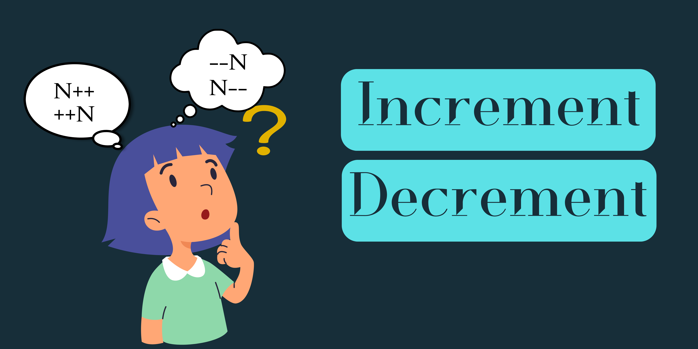

  

**Increment and decrement operators** in C++ are used to increase or decrease the value of a variable by 1. They are unary operators, meaning they operate on a single operand.

**Increment operator** is denoted by `++`. It can be used in two ways:

- **Prefix increment:** When used as a prefix operator, the value of the variable is incremented by 1 before it is used in the expression.
- **Postfix increment:** When used as a postfix operator, the value of the variable is used in the expression before it is incremented by 1.

**Decrement operator** is denoted by `--`. It can also be used in two ways:

- **Prefix decrement:** When used as a prefix operator, the value of the variable is decremented by 1 before it is used in the expression.
- **Postfix decrement:** When used as a postfix operator, the value of the variable is used in the expression before it is decremented by 1.

**Example:**

```c++
int x = 10;

// Prefix increment
++x; // x is now 11

// Postfix increment
x++; // x is now 12
// x++ == x += 1 == x = x + 1

// Prefix decrement
--x; // x is now 11

// Postfix decrement
x--; // x is now 10
```


**Differences between `n++` and `++n`**

The difference between `n++` and `++n` is the order in which the increment operation is performed.

- **n++:** The value of `n` is used in the expression before it is incremented by 1.
- **++n:** The value of `n` is incremented by 1 before it is used in the expression.

This difference is important when `n` is used in an expression with multiple operators.

**Example:**

```c++
int x = 10;
int y = 5;

// n++
int sum = x + n++; // sum is 15

// ++n
int product = x * ++n; // product is 16
```

In the first expression, `n` is used in the addition operation before it is incremented. This means that the value of `n` used in the expression is 10. In the second expression, `n` is incremented before it is used in the multiplication operation. This means that the value of `n` used in the expression is 11.

**Fun way to understand increment and decrement operators**

Imagine that you have a counter with a number displayed on it. The increment operator is like pressing a button on the counter that increases the number by 1. The decrement operator is like pressing a button on the counter that decreases the number by 1.

If you press the increment button before you look at the number on the counter, the number will be 1 higher than it was before you pressed the button. This is similar to prefix increment.

If you press the increment button after you look at the number on the counter, the number will be the same as it was before you pressed the button. This is similar to postfix increment.

Decrement operators work in the same way, but they decrease the number instead of increasing it.

---

#### Chapter 6: Looping World


The world of Loops can be a disaster for a beginner. Anyone can get lost inside this world very easily if they don't understand all the core concepts and fundamentals. Beginners often tend to just skim through this concept and later on regrets because loops will be used everywhere in every language. 

Suppose you want to print `Hello World` 10 times in a code. For that you have to write the code like this: 

```c++
#include<iostream>
using namespace std;

int main() 
{
	cout << "Hello World" << endl;
	cout << "Hello World" << endl;
	cout << "Hello World" << endl;
	cout << "Hello World" << endl;
	cout << "Hello World" << endl;
	cout << "Hello World" << endl;
	cout << "Hello World" << endl;
	cout << "Hello World" << endl;
	cout << "Hello World" << endl;
	cout << "Hello World" << endl;
	return 0;
}
```

In here we can see that to print the exact same thing multiple times, we have to write the same line of code reiteratively or multiple times. If we wanted to print `Hello world` 100 times then we had to write the the same line of code 100 times. This is not the right way or optimized way to do this kind of thing. To get rid of this repitativeness we use loops. Using loops we can do the exact same thing of the above like this: 

```c++
#include<iostream>
using namespace std;

int main() 
{
	for(int i = 1; i <= 10; i++)
	{
		cout << "Hello World" << endl;
	}
	return 0;
}
```

**What is a Loop?**

A loop in programming is a control flow statement that allows you to execute a block of code multiple times, until a certain condition is met. 

Loops are used to automate repetitive tasks, such as iterating over a list of items or performing a calculation multiple times.

>Imagine you are in a supermarket and you need to buy 10 apples. You could go to the apple bin and pick up one apple at a time, 10 times. But that would be inefficient.

>Instead, you could use a loop. You could say to yourself, "I need to pick up 10 apples. I will start by picking up one apple. Then, I will check to see if I have 10 apples yet. If not, I will pick up another apple. I will repeat this process until I have 10 apples."

>This is basically how a for loop works. You start with a counter variable, which is set to 0. Then, you check to see if the counter variable has reached the desired number of iterations. If not, you execute the block of code and increment the counter variable. You repeat this process until the counter variable has reached the desired number of iterations.

Loops are a very important concept in programming. They are used in all sorts of programs, from simple scripts to complex applications.

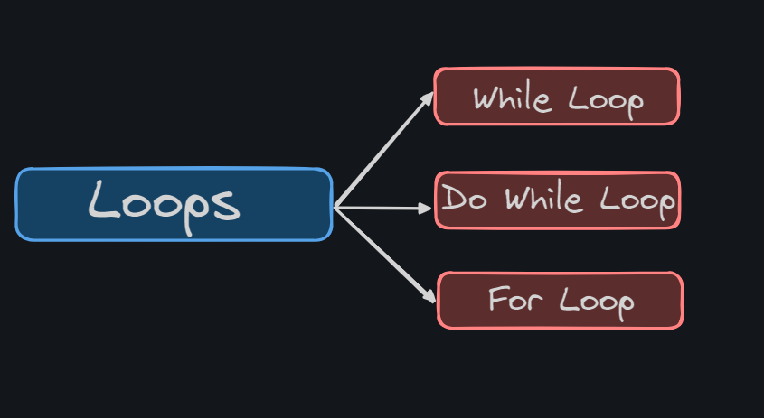

So Loops are basically three types: 

1. While loop: While loops are used when you don't know the exact number of times you want to execute a block of code, but you know the condition that needs to be met for the loop to stop.
2. Do While loop: Do-while loops are similar to while loops, but the block of code is executed at least once, even if the condition is not met.
3. For Loop:  For loops are used when you know the exact number of times you want to execute a block of code.

###### 1. While Loops: 

A while loop in C++ is a control flow statement that allows you to execute a block of code multiple times, until a certain condition is met. While loops are used when you don't know the exact number of times you want to execute a block of code, but you know the condition that needs to be met for the loop to stop.

The syntax for a while loop in C++ is as follows:

```c++
while (condition) {
  // block of code to be executed
}
```

The `condition` is a Boolean expression that evaluates to true or false. If the condition evaluates to true, the block of code is executed. Then, the condition is evaluated again. If the condition still evaluates to true, the block of code is executed again. This process continues until the condition evaluates to false. For Example: 

```c++
int i = 0;
while (i < 10) {
  cout << i << endl;
  i++;
}
```

This loop will print the numbers from 0 to 9, one per line. The `i` variable is used to keep track of the current iteration of the loop. The `i++` statement increments the value of `i` by 1. The loop will continue to execute until the value of `i` is equal to or greater than 10.

While loops can be used to perform a variety of tasks, such as:

- Iterating over a list of items
- Performing a calculation multiple times
- Waiting for an event to occur

Here is an example of a while loop that is used to iterate over a list of items:

```c++
int number = 15;
int i = 0;
while (i < number) 
{
  cout << i << endl;
  i++;
}
```

This loop will print the numbers from 0 to 14 as we have set the condition to less than 15. The `i` variable is used to keep track of the loop and then print it. After printing it will then increment itself and then again check the condition.

Here is an example of a while loop that is used to perform a calculation multiple times:

```c++
#include<iostream>
using namespace std;

int main()
{
	double sum = 0;
	int i = 0;
	while (i < 100) {
	  sum += i;
	  i++;
	}
	cout << sum << endl;
	return 0;
}
```

This loop will calculate the sum of the numbers from 0 to 99. The `sum` variable is used to store the sum of the numbers. The `i++` statement increments the value of `i` by 1. The loop will continue to execute until the value of `i` is equal to or greater than 100.

While loops are a powerful tool that can be used to automate repetitive tasks and make your code more efficient.

###### 2. Do While Loops: 
  
A do-while loop in C++ is a control flow statement that allows you to execute a block of code multiple times, until a certain condition is met. Do-while loops are similar to while loops, but the block of code is executed at least once, even if the condition is not met.

The syntax for a do-while loop in C++ is as follows:

```c++
do {
  // block of code to be executed
} while (condition);
```

The condition is a Boolean expression that evaluates to true or false. If the condition evaluates to true, the block of code is executed again. This process continues until the condition evaluates to false.

Here is a simple example of a do-while loop in C++:

```c++
int i = 0;
do {
  cout << i << endl;
  i++;
} while (i < 10);
```

This loop will print the numbers from 0 to 9, one per line. The `i++` statement increments the value of `i` by 1. The loop will continue to execute until the value of `i` is equal to or greater than 10.

Do-while loops are often used to get user input. For example, the following code would prompt the user to enter a number between 1 and 10, and continue to prompt them until they enter a valid number:

```c++
int number;
do {
  cout << "Enter a number between 1 and 10: ";
  cin >> number;
} while (number < 1 || number > 10);
```

###### 3. For Loops: 

A for loop in C++ is a control flow statement that allows you to execute a block of code multiple times, a fixed number of times. For loops are used when you know the exact number of times you want to execute a block of code.

The syntax for a for loop in C++ is as follows:

```c++
for (initializer; condition; increment) {
  // block of code to be executed
}
```

The initializer is executed once before the loop starts. The condition is evaluated before each iteration of the loop. If the condition evaluates to true, the block of code is executed. Then, the increment is executed. The loop continues to execute until the condition evaluates to false.

Here is a simple example of a for loop in C++:

```c++
for (int i = 0; i < 10; i++) {
  cout << i << endl;
}
```

This loop will print the numbers from 0 to 9, one per line. The `i` variable is used to keep track of the current iteration of the loop. The `i < 10` condition ensures that the loop does not execute past the number 9. The `i++` statement increments the value of `i` by 1.

For loops can be used to perform a variety of tasks, such as:

- Iterating over a list of items
- Performing a calculation multiple times
- Traversing an array or other data structure

Here is an example of a for loop that is used to perform a calculation multiple times:

```c++
int sum = 0;
for (int i = 0; i < 100; i++) {
  sum += i;
}
cout << sum << endl;
```

This loop will calculate the sum of the numbers from 0 to 99. The `sum` variable is used to store the sum of the numbers. The `i++` statement increments the value of `i` by 1. The loop will continue to execute until the value of `i` is equal to or greater than 100.

For loops are a powerful tool that can be used to automate repetitive tasks and make your code more efficient.

Here is a fun analogy to help you understand for loops:

>Imagine you are painting a fence. You know that the fence is 10 feet long, so you need to paint 10 times. You could start at one end of the fence and paint until you reach the other end. Then, you could start at the beginning of the fence again and paint until you reach the end. You could repeat this process until you have painted the fence 10 times.

This is basically how a for loop works. You start with a counter variable, which is set to 0. Then, you check to see if the counter variable has reached the desired number of iterations. If not, you execute the block of code and increment the counter variable. You repeat this process until the counter variable has reached the desired number of iterations.

For loops are a very important concept in programming. They are used in all sorts of programs, from simple scripts to complex applications.

---

> Let's Create a Difference, Together
